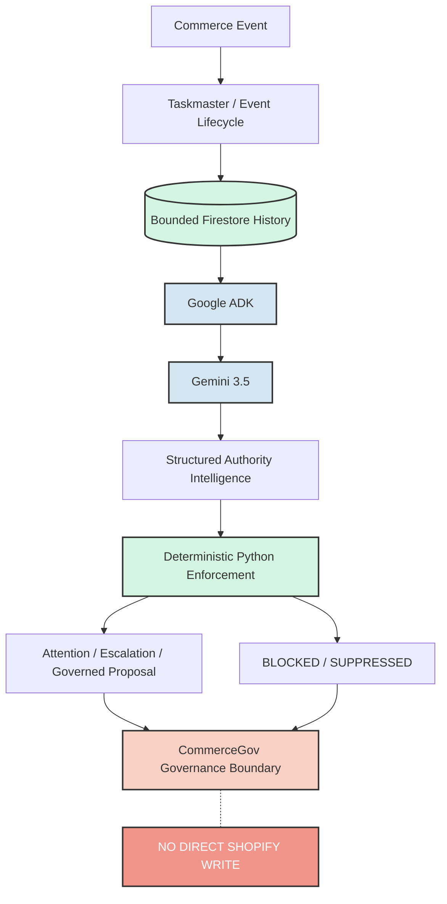

# Architecture

Phase 1 is a small event-to-checkpoint service. It accepts the hackathon adapter contract directly or inside a Pub/Sub push envelope, validates it, calls one bounded ADK/Gemini assessment, validates the result in Python, and persists a workflow checkpoint in `authority_agent_runs`.

```text
Commerce Event
      ↓
Validate / Normalize
      ↓
Deterministic Fingerprint
      ↓
Single-flight / Lease (Firestore)
      ↓
Google ADK + Gemini (Vertex AI)
      ↓
Structured Assessment
      ↓
Python Schema / Authority Enforcement
      ↓
Evidence-Bound Checkpoint
      ↓
CommerceGovProposalV1
      ↓
Terminal / Replay-Safe State
```

## Phase 3: Authority Intelligence

Phase 3 introduces the Authority Intelligence layer which reasons across multiple events to determine when operator attention is required. 

**Conceptual Architecture:**



**Core Components:**
- **Taskmaster**: durable continuous runtime
- **Authority Intelligence**: correlation + relevance + prioritization
- **Gemini**: semantic reasoning engine
- **Firestore**: durable operational memory
- **CommerceGov**: production authority / enforcement boundary

**Important Boundaries & Trust Rules:**
- **The AI reasons about operations. It does not get to redefine production authority.**
- **The agent does not own production authority.** Gemini recommends an assessment only.
- Python enforces constraints. For example, if a change requires human review per policy, it forces `WAITING_FOR_HUMAN_AUTHORITY`, disregarding unsafe autonomous classifications.
- **Assessment ≠ Production Approval.** The LLM assessing an event is not the same as the final authoritative human or downstream approval.
- **Applied ≠ Verified.** Execution is handled by CommerceGov. Taskmaster does not apply changes or verify production state.
- For one `event_id`, a terminal persisted checkpoint is returned on replay without a second model call (preventing duplicate AI charges or hallucination loops).
- The store and assessor are dependency-injected; tests use both in-memory and fake implementations and make no network calls.
