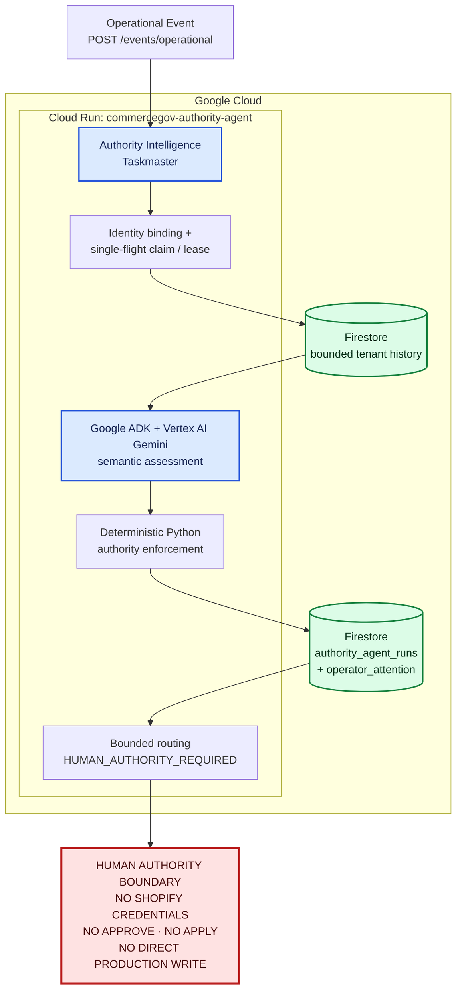
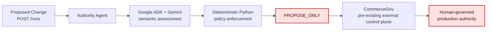

# Architecture

The hackathon submission centers on an event-driven Authority Intelligence workflow deployed on Google Cloud Run. It performs autonomous assessment and routing, then stops at the human authority boundary.

## Primary Taskmaster demo path

1. An authenticated operational event starts one bounded workflow; there is no polling loop.
2. The service binds the event ID to tenant and governed-target identity, fingerprints its evidence, and acquires a transactional single-flight lease.
3. Firestore returns up to five related Authority Intelligence runs for the same tenant-scoped attention key.
4. Google ADK invokes Gemini at most once to produce a structured semantic assessment.
5. Python validates the result and enforces deterministic routing safeguards. A proven governed external mismatch cannot be classified below `AUTHORITY_AT_RISK` and must recommend `INVESTIGATE_RISK`.
6. Firestore persists the run and severity-aware `operator_attention` state before the service returns its bounded result.
7. `REVIEW_REQUIRED`, `AUTHORITY_AT_RISK`, and `ACTION_REQUIRED` route to `HUMAN_AUTHORITY_REQUIRED`.

Authority Intelligence does not call CommerceGov, approve or apply a change, or write to Shopify.

## Separate Authority Agent proposal path

This is a related workflow, not a continuation of the Authority Intelligence diagram above.

The Authority Agent returns `READY_FOR_GOVERNED_EXECUTION`, `HUMAN_AUTHORITY_REQUIRED`, or `BLOCKED`. Only a permitted `CONTINUE` result may be handed off as a versioned CommerceGov proposal. The agent still has no approval, apply, Shopify credential, or direct production-write capability.

## Component responsibilities

| Component | Responsibility | Explicit non-responsibility |
|---|---|---|
| Cloud Run | Hosts the authenticated, event-driven FastAPI service | Does not create production authority |
| Google ADK | Runs a bounded, schema-constrained agent interaction | Does not enforce the final authority floor |
| Vertex AI Gemini (`gemini-3.5-flash`) | Semantically assesses the current event and relevant history | Does not approve or apply changes |
| Deterministic Python | Validates identity, schema and evidence; controls leases, replay behavior and authority routing | Does not grant itself external authority |
| Firestore `authority_agent_runs` | Stores durable ownership, attempts, evidence, workflow state and terminal outcomes | Is not merely a log sink |
| Firestore `operator_attention` | Maintains durable, severity-aware operator-attention state | Does not execute production changes |
| CommerceGov | External, pre-existing governance control plane for proposal review and production authority | Is not part of the demonstrated Authority Intelligence execution path |

## Deployment and trust boundary

- Google Cloud project: `commercegov-vertex-2026`
- Cloud Run service: `commercegov-authority-agent`, region `us-central1`
- Production revision: `commercegov-authority-agent-00019-wb5` with 100% traffic
- Runtime assessment location: `global`
- Model: `gemini-3.5-flash`
- Production persistence: Firestore `(default)` with `USE_IN_MEMORY_STORE=false`
- Frozen code SHA: `63331870a3e9097e28a855eb05229424d03515ce`

The Taskmaster holds zero Shopify production credentials. Gemini provides semantic reasoning; deterministic code constrains the workflow; humans and the external CommerceGov governance plane retain production authority.
